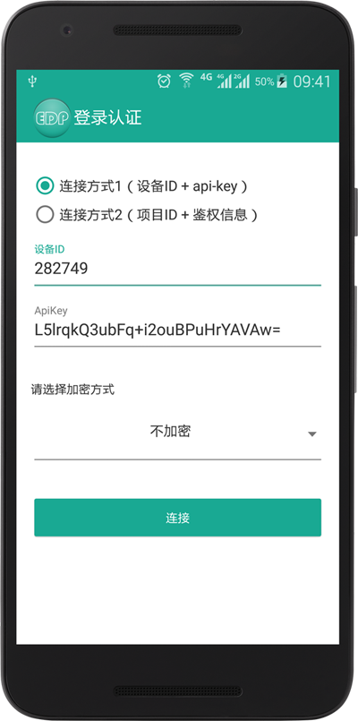
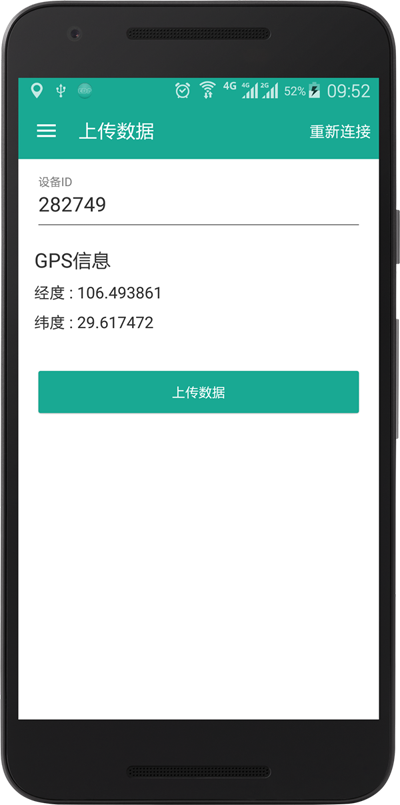
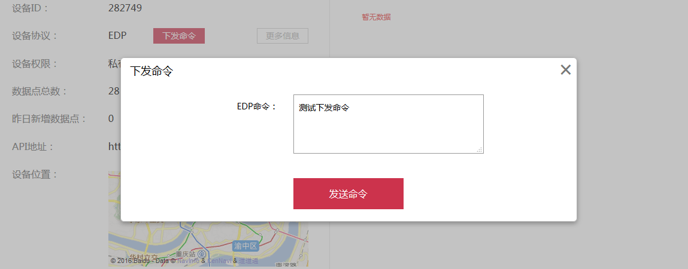
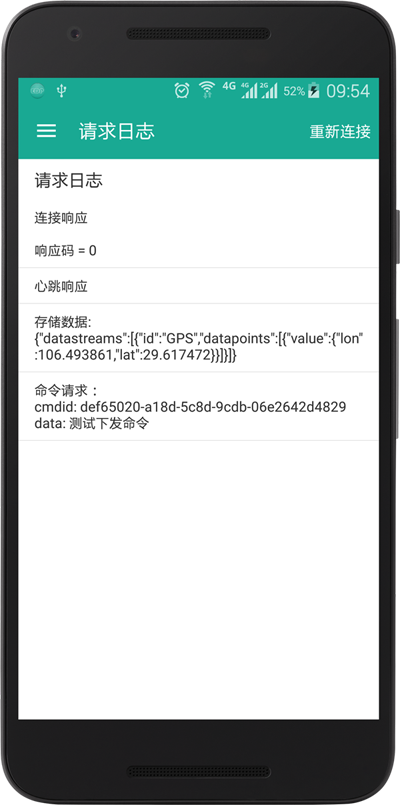

# Android-EDP-SDK

[  ](https://bintray.com/darren/maven/Android-EDP-SDK/_latestVersion)
[]()

## 简介

Android-EDP-SDK是对 **中移物联网公司 OneNET**平台 **EDP**（Enhanced Device Protocol）接入协议在Android平台的实现。同时该项目也提供了一个示例工程。

本项目的开发基于[https://github.com/cm-heclouds/JAVA-EDP-SDK](https://github.com/cm-heclouds/JAVA-EDP-SDK)，在此基础上做了如下修改：

- 增加了命令请求和命令响应
- 增加了加密通信
- 针对Android平台对消息的发送做了封装（长链接、自动发送心跳、连接状态监听等）

适用对象：

- 运行Android操作系统（API level 8+）并希望通过EDP协议接入OneNET的设备，包括：Phone、Tablet、Wear、TV、Android Auto，但不包括Brillo
- 希望使用Android手机模拟EDP设备的开发者

更多 **EDP** 相关的内容请在[文档中心](https://open.iot.10086.cn/doc/art254.html#68)的**资源下载**页面下载EDP文档并阅读。

## Android Studio配置

```groovy
dependencies {
    implementation 'com.chinamobile.iot.onenet.edp:Android-EDP-SDK:1.1.1'
}
```

## 相关接口

###### EdpClient.java

|方法                                           |描述                     |参数|
|:---------------------------------------------|:------------------------|:---|
|public void connect()                         |建立TCP连接               |void|
|public void connect(String host, int port)|与指定ip与端口的主机建立TCP连接|host: 主机ip; port: 端口|
|public void disconnect()                      |断开连接                  |void|
|public boolean isConnected()|设备是否在线|void|
|public void pushData(long deviceId, byte[] data)|转发（透传）数据          |deviceId: 设备ID; data: 消息体（字节数组）|
|public void pushData(long deviceId, String data)|转发（透传）数据          |deviceId: 设备ID; data: 消息体（字符串）|
|public void requestEncrypt(int algorithm)|发送加密请求|algorithm: 加密类型|
|public void setPingInterval(long milliseconds)|设置心跳周期               |毫秒  |
|public void sendConnectReq()                  |发送连接请求               |void|
|public void sendHeartbeat()                   |发送心跳                  |void|
|public void saveData(String desDeviceId, int dataType, String tokenStr, byte[] data)|存储（&转发）数据|desDeviceId: 设备ID; dataType: 数据类型; tokenStr: 用户自定义字符串, 该参数不为null时, 平台将回传"存储确认"; data: 消息体|
|public void sendCmdResp(String cmdid, byte[] data)|发送命令响应|cmdid: 命令的ID; data: 消息体|

## 代码示例

SDK简化了EDP API的使用，开发者只要专注于程序逻辑的编写，不用关心消息的封包解包等底层操作。

绝大多数操作都可以通过[EdpClient.java](Android-EDP-sdk/src/com/chinamobile/iot/onenet/edp/toolbox/EdpClient.java)中的方法完成。通常将设备接入OneNET只需如下几个步骤：

```java
    // 1、初始化SDK
    EdpClient.initialize(this, connetcType, id, authInfo);

    // 2、设置接收响应的回调
    EdpClient.getInstance().setListener(mEdpListener);

    // 3、设置自动发送心跳的周期（默认4min）
    EdpClient.getInstance().setPingInterval(3 * 60 * 1000);

    // 4、建立TCP连接
    EdpClient.getInstance().connect();

    if (Common.Algorithm.NO_ALGORITHM == encryptType) {
        // 5、如果使用明文通信，则建立连接后直接发送连接请求
        EdpClient.getInstance().sendConnectReq();
    } else if (Common.Algorithm.ALGORITHM_AES == encryptType) {
        // 6、如果使用加密通信，则先发送加密请求，然后在加密响应回调中发送连接请求
        EdpClient.getInstance().requestEncrypt(Common.Algorithm.ALGORITHM_AES);
    }
```

```java
    private Listener mEdpListener = new Listener() {

        @Override
        public void onReceive(List<EdpMsg> msgList) {
            if (null == msgList) {
                return;
            }
            for (EdpMsg msg : msgList) {
                if (null == msg) {
                    continue;
                }
                switch (msg.getMsgType()) {

                    // 连接响应
                    case Common.MsgType.CONNRESP:
                        break;

                    // 心跳响应
                    case Common.MsgType.PINGRESP:
                        break;

                    // 存储确认
                    case Common.MsgType.SAVERESP:
                        break;

                    // 转发（透传）
                    case Common.MsgType.PUSHDATA:
                        break;

                    // 存储（转发）
                    case Common.MsgType.SAVEDATA:
                        break;

                    // 命令请求
                    case Common.MsgType.CMDREQ:
                        break;

                    // 加密响应
                    case Common.MsgType.ENCRYPTRESP:
                        break;
                }
            }
        }

        @Override
        public void onFailed(Exception e) {
            e.printStackTrace();
        }

        @Override
        public void onDisconnect() {

        }
    };
```

**最后一定要记得在主工程的AndroidManifest.xml中注册发送心跳的服务，否则不会自动发送心跳**

```xml
    <?xml version="1.0" encoding="utf-8"?>
    <manifest ...>

        <application ...>

            <!-- 在主工程的AndroidManifest.xml中注册发送心跳的服务 -->
            <service android:name="com.chinamobile.iot.onenet.edp.toolbox.EdpService"/>

        </application>

    </manifest>
```

## Screenshots

### 登录认证


### 上传数据



### 下发命令



### 请求日志

